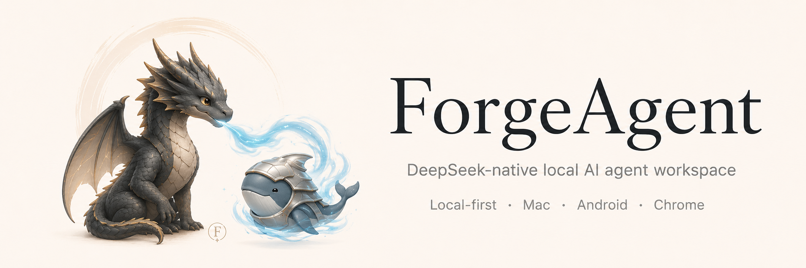

# ForgeAgent

<p align="center">
  
</p>

**DeepSeek-native local AI agent workspace for Mac, Chrome, Android, MCP, browser automation, long-context coding, and private multi-device workflows.**

ForgeAgent 是一个本地优先的 AI Agent 工作台，也是一个面向 DeepSeek 的 agent harness。它运行在你的 Mac 上，以项目文件夹为工作区，让 Agent 能在受控权限下读写文件、执行工具、使用 Chrome、调用 MCP server，并通过 Web Console、macOS App 和 Android App 多端协同。

如果你在寻找 **DeepSeek Agent**、**本地 AI Agent**、**Claude Code / Codex 风格工作台**、**MCP client**、**Chrome browser agent**、**long-context agent harness** 或 **Android 远程控制 Mac 上的 AI Agent**，ForgeAgent 的目标就是把这些能力合成一个本地产品。

核心原则很简单：

- **你的 Mac 是本体**：Forge Core 在本机运行，数据、会话、权限和工具执行都留在本地。
- **Web Console 是统一界面**：浏览器、macOS App、Android App 都使用同一套消息流和状态展示。
- **项目就是文件夹**：每个项目对应一个 workspace，Agent 的文件操作和沙盒边界按项目隔离。
- **错误对 Agent 可见**：工具失败、权限拒绝、沙盒拦截都会以可读文本回到消息流，Agent 可以尝试自我修正。

## 主要能力

- DeepSeek-native agent harness：真实 token usage、context usage、prefix cache hit/miss、reasoning token 和成本记录
- 多 session、多项目、多设备同步
- 本地 Web Console，支持 Markdown、受限 HTML、代码块、文件上传和消息分叉
- macOS App：启动或复用本机 Forge Core，并承载完整 Web Console
- Android App：扫码配对 Mac 后远程操作同一个 ForgeAgent
- DeepSeek provider 配置、真实 token/context usage、cache hit 指标
- 权限审批、session 级 Danger Free 模式、workspace sandbox
- Chrome/ForgeWebridge 浏览器连接，使用你本机 Chrome 的登录态
- MCP client：连接 stdio、streamable-http、legacy SSE MCP server
- Artifact 自动落盘：大工具输出保存为 artifact，消息流保留预览和指针
- 长期记忆、skills、scheduler、runtime recovery、通知

## 为什么是 DeepSeek-native

ForgeAgent 优先适配 DeepSeek API，而不是只把 DeepSeek 当成普通 OpenAI-compatible endpoint：

- 读取真实 `prompt_tokens`、`completion_tokens`、`total_tokens`
- 读取 prefix cache hit/miss，用于观察缓存命中率
- 读取 reasoning tokens，用于区分推理消耗和输出消耗
- 使用真实 context usage 触发 compaction，避免靠粗略估算误导用户
- compaction 后先显示本地估计的压缩后上下文占用，下一次模型调用再用 provider telemetry 校准
- 每次模型调用写入 usage ledger，并通过 Web Console / HTTP / SSE 展示

这让 ForgeAgent 更适合作为 DeepSeek 长上下文 Agent、代码工作台、浏览器自动化 Agent 和多工具 agent runtime。

## 快速开始

### 1. 从源码启动本地 Web Console

需要 Node.js 20+。

```sh
npm install
npm run product:build
npm run install:local
```

`install:local` 会构建 Web Console，安装并启动本机 LaunchAgent，然后打开：

```text
http://127.0.0.1:3000
```

首次打开时，在界面里配置 DeepSeek API Key、Base URL、模型和上下文窗口。`.env` 仍可作为开发兼容入口，但普通用户推荐直接在 Web Console 里配置。

### 2. 使用 macOS App

从源码打包：

```sh
npm run macos:build
npm run macos:package
open apps/macos/ForgeAgentMac/dist/ForgeAgent.app
```

打开 `ForgeAgent.app` 后，它会启动或复用本机 Forge Core，并在 WKWebView 中显示完整 Web Console。关闭窗口后，Core 可以继续在后台运行；Mac 真正睡眠、合盖断网或断电时，远程手机操作会中断。

### 3. 配对 Android

Android App 不运行 Core，它是远程设备客户端。

1. 在 Mac 的 Web Console 或 macOS 菜单里打开 **Pair Android**。
2. 在 Android App 里点击扫码。
3. 扫描二维码后，Android 会保存 Mac 地址和设备 token。
4. 配对完成后，手机会加载同一套 Web Console。

构建 Android APK：

```sh
npm run android:build
```

APK 路径：

```text
apps/android/ForgeAgentAndroid/app/build/outputs/apk/debug/app-debug.apk
```

Android 后台服务会保持连接状态通知，并在 Agent 回复、权限请求、MCP elicitation 或 session blocked 时发出业务通知。手机必须能访问 Mac 的局域网、Tailscale、ZeroTier 或其他私网地址。

## 连接 Chrome

ForgeAgent 的默认浏览器能力通过 ForgeWebridge Chrome 扩展接入。它让 Agent 使用你当前 Chrome profile 中可见的登录态页面。

打包并打开扩展目录：

```sh
npm run webridge:package
npm run webridge:open
```

然后在 Chrome 中：

1. 打开 `chrome://extensions`
2. 开启 Developer mode
3. Load unpacked，选择 ForgeWebridge 扩展目录
4. 如果扩展已安装，点击 Reload 或 Refresh connection

扩展会自动发现本机 ForgeAgent、自动配对并保持 heartbeat。浏览器工具离线时，Agent 会收到可读错误，而不是不透明超时。

## 使用 MCP

ForgeAgent 可以作为 MCP client 连接外部 MCP server。MCP 工具仍会走 ForgeAgent 的权限、沙盒、artifact 和 thread 机制。

常用命令：

```sh
npm run mcp -- list
npm run mcp -- add
npm run mcp -- status
npm run mcp -- doctor
```

项目里的 `.mcp.json` 默认只会被发现，不会自动信任或启用。需要用户确认后才会进入可用工具集。

## 数据和安全

- 本地源码运行默认数据目录：`.forge/`
- macOS App 默认数据目录：`~/Library/Application Support/ForgeAgent/data`
- API Key 保存在本机配置中，状态和诊断接口只返回 masked key
- HTTP Gateway 是单用户、多设备模型，业务 API 默认需要 device token
- Pairing code 是一次性、短时有效
- Danger Free 是 session 级开关，只影响当前 session 的审批策略
- Workspace sandbox 会限制文件工具访问项目根和 session scratch workspace

ForgeAgent V1 是本地/私网优先产品，不是 SaaS 多用户服务。若要暴露到公网，请自行通过 HTTPS reverse proxy、Cloudflare Tunnel、Tailscale Funnel 等方式处理网络安全边界。

## 常见问题

### 打不开 Web Console

先检查服务状态和日志：

```sh
npm run status
npm run doctor
npm run logs
```

如果服务异常，可以重启：

```sh
npm run forgeagent -- restart
```

### Android 无法连接 Mac

确认：

- Mac 上 ForgeAgent Core 正常运行
- 手机和 Mac 在同一局域网或同一私网/VPN
- Web Console 的 Pair Android 使用的是手机可访问的 LAN URL
- Android 通知权限和前台服务未被系统电池策略关闭

### Agent 不能操作文件

确认当前 session 属于正确项目。ForgeAgent 按项目文件夹建立 workspace sandbox，项目外路径会被拦截，除非用户明确扩大权限。

## 开发者文档

面向使用者的 README 只保留安装和使用路径。开发、测试、架构和发布 gate 见：

- [开发指南](docs/development.md)
- [架构规范](docs/forge_agent_v_2_architecture_spec.md)
- [原生 App 说明](docs/native-apps.md)
