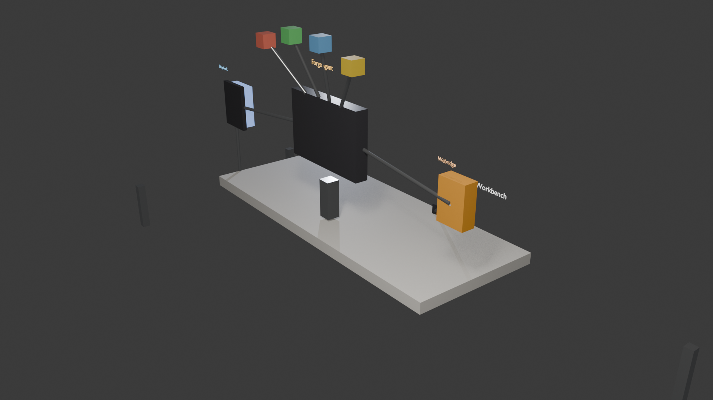
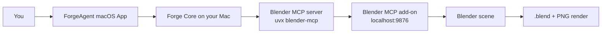
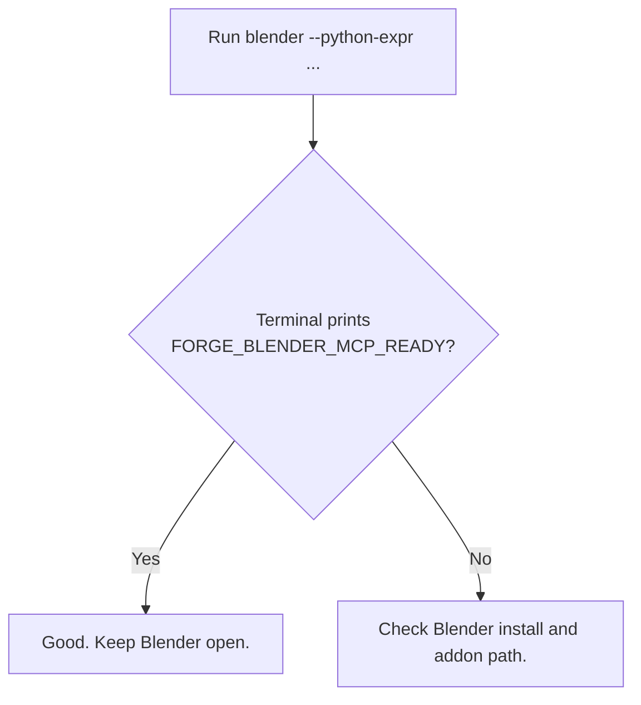
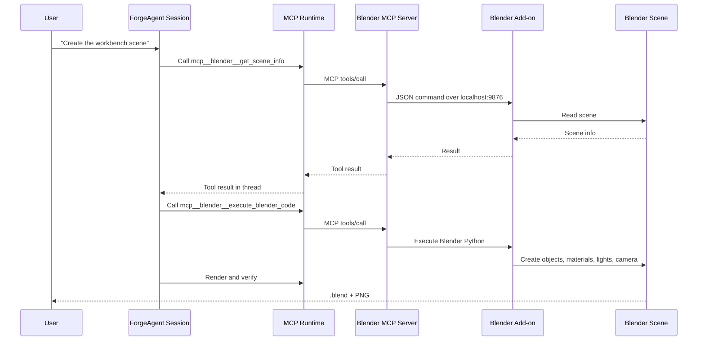

# ForgeAgent + Blender MCP Quick Start

This guide walks you from a fresh Git clone to a real Blender render made by ForgeAgent through Blender MCP.

这份教程尽量写成“照着做就能成功”的版本。你不需要先理解 MCP，只要记住一句话：

> Blender MCP 有两半：ForgeAgent 里注册一个 MCP server，Blender 里也要启动一个 socket add-on。两边都开着，Agent 才能控制 Blender。

最终你会得到类似这样的结果：



## 0. What You Will Build

ForgeAgent 会在 Blender 里创建一个低多边形 “ForgeAgent Local AI Workbench” 场景：

- 桌面和显示器
- DeepSeek token/cache 仪表
- Chrome/Webridge 节点
- Android 手机节点
- MCP / Tool / Memory / Skill 小节点
- 线缆、灯光、相机、文字标签
- `.blend` 文件和 PNG 渲染图



## 1. Install Basic Tools

Open **Terminal** on your Mac.

### 1.1 Install Xcode Command Line Tools

```sh
xcode-select --install
```

If macOS says the tools are already installed, that is fine.

### 1.2 Install Homebrew

If you already have Homebrew, skip this step.

```sh
/bin/bash -c "$(curl -fsSL https://raw.githubusercontent.com/Homebrew/install/HEAD/install.sh)"
```

Check it:

```sh
brew --version
```

### 1.3 Install Node.js, Git, uv, and Blender

```sh
brew install node git uv
brew install --cask blender
```

Check them:

```sh
node --version
npm --version
git --version
uvx --version
blender --version
```

If all commands print versions, this step is done.

## 2. Clone ForgeAgent

On the GitHub page, click the green **Code** button and copy the repository URL.

Then run:

```sh
git clone https://github.com/YOUR_NAME_OR_ORG/ForgeAgent.git
cd ForgeAgent
npm install
```

Replace `https://github.com/YOUR_NAME_OR_ORG/ForgeAgent.git` with the URL you copied.

## 3. Build and Open the macOS App

Build the app from source:

```sh
npm run macos:package
```

Open it:

```sh
open apps/macos/ForgeAgentMac/dist/ForgeAgent.app
```

You should see the ForgeAgent window. The macOS App starts or reuses the local Forge Core, then loads the same Web Console used in the browser.

If the app shows a setup screen, configure your model provider:

- Provider: DeepSeek
- API Key: your DeepSeek API key
- Base URL: keep the default unless your provider tells you otherwise
- Model: keep the default shown by ForgeAgent, or use the model name from your DeepSeek account
- Context window: keep the default unless you know you need to change it

Click the test/save button in the setup screen. When the app can talk to the model, continue.

## 4. Start the Blender Side of Blender MCP

This is the part many people miss.

ForgeAgent can start the MCP process, but Blender itself also needs a small add-on running inside Blender. The add-on listens on:

```text
localhost:9876
```

### 4.1 Download the Blender MCP add-on

In Terminal:

```sh
mkdir -p "$HOME/.forge/external"
git clone https://github.com/ahujasid/blender-mcp.git "$HOME/.forge/external/blender-mcp"
```

If Terminal says the folder already exists, that is okay. You can update it with:

```sh
git -C "$HOME/.forge/external/blender-mcp" pull
```

### 4.2 Open Blender and auto-start the add-on socket

Run this command:

```sh
blender --python-expr "import importlib.util, bpy, os; p=os.path.expanduser('~/.forge/external/blender-mcp/addon.py'); spec=importlib.util.spec_from_file_location('forge_blender_mcp_addon', p); mod=importlib.util.module_from_spec(spec); spec.loader.exec_module(mod); mod.register(); bpy.context.scene.blendermcp_port=9876; bpy.ops.blendermcp.start_server(); print('FORGE_BLENDER_MCP_READY')"
```

Blender should open. In Terminal, you should see:

```text
FORGE_BLENDER_MCP_READY
```

Keep this Blender window open while you use the MCP tools.



## 5. Register Blender MCP in ForgeAgent

You can do this from the ForgeAgent UI or from Terminal. Use the UI path if you are new. It talks to the running ForgeAgent Core directly.

### Option A: UI Path

1. Go back to **ForgeAgent**.
2. Open **Extensions**.
3. Search for:

```text
blender
```

4. Find **Blender MCP**.
5. Click **Install**.
6. If it says setup is required, that means Blender must be open with the socket running. You already did that in step 4.
7. Enable it if the UI asks you to enable it.
8. Open the MCP status panel and click **Retry** or **Connect** for Blender.

Success looks like:

```text
Blender
connected
22 tools
```

### Option B: Terminal Path

Use this only if the UI path is unavailable. These commands write the macOS App data directory. After using them, restart ForgeAgent Core so the running app reloads the config.

```sh
DATA_DIR="$HOME/Library/Application Support/ForgeAgent/data"
```

Install the built-in Blender MCP catalog entry:

```sh
npm run mcp -- install mcp-server-blender --data-dir "$DATA_DIR"
```

Enable it:

```sh
npm run mcp -- enable blender --data-dir "$DATA_DIR"
```

Restart ForgeAgent Core from the app:

1. In the ForgeAgent window, click **Restart Core** if you see it.
2. Or quit and reopen `ForgeAgent.app`.

Then open the MCP panel in ForgeAgent and click **Retry** or **Connect** for Blender.

You can also run this command as a standalone check:

```sh
npm run mcp -- list --data-dir "$DATA_DIR"
```

You want to see something like:

```text
blender    connected    tools=22
```

If it says it cannot connect to Blender, go back to step 4 and make sure Blender is still open and `FORGE_BLENDER_MCP_READY` was printed.

## 5.5. What If the MCP Is Not in ForgeAgent's Built-In List?

ForgeAgent can use MCP servers that are not bundled in the Extensions page. The important rule is:

> Use the MCP server's official README or Claude Desktop config example as the source of truth for `command`, `args`, `env`, and `url`.

Do not guess these fields from the GitHub repository name. A real MCP package may need a different npm package name, `uvx` command, API key, database URL, OAuth setup, or extra startup arguments.

### Easiest path: paste a package or repo into Extensions

In ForgeAgent:

1. Open **Extensions**.
2. Paste the npm package name or GitHub link into **Search** or **Link**.
3. If ForgeAgent recognizes it, inspect the install card:
   - command
   - args
   - required env values
   - setup required notes
4. Install it.
5. Enable it only after the command and required secrets look correct.

This works best for public npm MCP packages and simple GitHub MCP repositories. If the card says setup is required, fill in the missing API key, token, or connection string before expecting tools to work.

### Most reliable path: add the MCP server explicitly

If the MCP README gives a config block like this:

```json
{
  "mcpServers": {
    "example": {
      "command": "npx",
      "args": ["-y", "@example/mcp-server", "--workspace", "/path/to/workspace"],
      "env": {
        "EXAMPLE_API_KEY": "your-key"
      }
    }
  }
}
```

register the same values in ForgeAgent:

```sh
DATA_DIR="$HOME/Library/Application Support/ForgeAgent/data"

npm run mcp -- add \
  --data-dir "$DATA_DIR" \
  --name example \
  --transport stdio \
  --command npx \
  --args "-y,@example/mcp-server,--workspace,/path/to/workspace" \
  --env '{"EXAMPLE_API_KEY":"your-key"}' \
  --trust untrusted \
  --enabled
```

For a `uvx` server, the shape is the same:

```sh
npm run mcp -- add \
  --data-dir "$DATA_DIR" \
  --name my-uvx-server \
  --transport stdio \
  --command uvx \
  --args "some-mcp-package" \
  --enabled
```

For an HTTP MCP server:

```sh
npm run mcp -- add \
  --data-dir "$DATA_DIR" \
  --name my-http-mcp \
  --transport streamable-http \
  --url "https://example.com/mcp" \
  --headers '{"Authorization":"Bearer your-token"}' \
  --enabled
```

After using the Terminal path, restart ForgeAgent Core from the macOS App so the running app reloads the new MCP config.

### Natural-language path

You can also ask ForgeAgent in a session:

```text
帮我安装这个 MCP：https://github.com/owner/repo
如果它不在 ForgeAgent 官方库里，请先阅读官方 README，提取 MCP 配置里的 command、args、env，让我确认后再启用。
```

ForgeAgent should use its extension/MCP tools to install the server. If it cannot infer a safe config, it should ask you for the missing command, API key, token, or connection URL instead of silently guessing.

### Safety checklist for unknown MCP servers

- Prefer official repositories and package-manager names from the author's README.
- Read the command before enabling it.
- Keep API keys local; do not paste secrets into random web pages.
- Start unknown MCP servers as `untrusted` first.
- ForgeAgent's runtime permissions and workspace sandbox still apply after the MCP is installed.

## 6. Create a New Session

In ForgeAgent:

1. Click **+ New Session**.
2. Pick or keep the default workspace project.
3. In this tutorial, use one of these permission choices:
   - Safer: when permission cards appear, click **Allow for this session**.
   - Easiest: click **Danger free** only for this tutorial session.

Blender MCP can run Python code inside Blender. Only use it with MCP servers and prompts you trust.

## 7. Ask ForgeAgent to Build the Scene

Paste this prompt into the session:

```text
请做一次真实 Blender MCP 端到端测试。必须使用已经连接的 Blender MCP 工具，例如 mcp__blender__execute_blender_code 和 mcp__blender__get_scene_info，不要用 bash/Python 文件脚本绕过 MCP。

任务：
1. 清空当前 Blender 场景。
2. 创建一个低多边形 “ForgeAgent Local AI Workbench” 场景：桌面、显示 ForgeAgent Web Console 的显示器、DeepSeek token/cache 仪表、Chrome/Webridge 节点、Android 手机节点、MCP/Tool/Memory/Skill 小节点，用线缆连接。至少 15 个对象、5 种材质、2 盏灯、1 个相机，并加 4 个可见文字标签。
3. 把文件保存为 /Users/YOUR_MAC_USERNAME/Documents/ForgeAgent Workspace/blender-mcp-e2e/forgeagent-workbench.blend，并渲染 PNG 到 /Users/YOUR_MAC_USERNAME/Documents/ForgeAgent Workspace/blender-mcp-e2e/forgeagent-workbench.png。
4. 完成后调用 mcp__blender__get_scene_info 验证对象数量，并用中文总结创建了什么、保存路径是什么、是否成功。

如果工具返回错误，请读取错误文本并修正后继续，不要直接放弃。
```

Important: replace `YOUR_MAC_USERNAME` with your macOS username.

For example, if your home folder is `/Users/alice`, use:

```text
/Users/alice/Documents/ForgeAgent Workspace/blender-mcp-e2e/forgeagent-workbench.blend
```

## 8. Watch the Tool Calls

While ForgeAgent works, you should see tool calls such as:

```text
mcp__blender__get_scene_info
mcp__blender__execute_blender_code
mcp__blender__get_viewport_screenshot
```

That means ForgeAgent is really using Blender MCP.

If Blender returns an error, ForgeAgent should read the error text and try a fix. For example, Blender 5 may use different material node names than older versions; the Agent can inspect the node and continue.

## 9. Inspect the Result

When the session finishes, it should mention the saved files.

Open the PNG:

```sh
open "$HOME/Documents/ForgeAgent Workspace/blender-mcp-e2e/forgeagent-workbench.png"
```

Open the Blender file:

```sh
open "$HOME/Documents/ForgeAgent Workspace/blender-mcp-e2e/forgeagent-workbench.blend"
```

You should see a render like this:


## 10. Success Checklist

You are done when all boxes are true:

- [ ] ForgeAgent macOS App opens.
- [ ] The model provider test succeeds.
- [ ] Blender is open.
- [ ] Terminal printed `FORGE_BLENDER_MCP_READY`.
- [ ] The ForgeAgent MCP panel shows Blender connected, or the standalone `npm run mcp -- list --data-dir "$HOME/Library/Application Support/ForgeAgent/data"` check shows Blender connected.
- [ ] A ForgeAgent session used `mcp__blender__...` tools.
- [ ] The session ended normally, not blocked.
- [ ] You have a `.blend` file.
- [ ] You have a `.png` render.

## Troubleshooting

### `uvx: command not found`

Install uv:

```sh
brew install uv
```

### `blender: command not found`

Install Blender:

```sh
brew install --cask blender
```

Then close and reopen Terminal.

### ForgeAgent says Blender MCP cannot connect

Blender is not listening on `localhost:9876`.

Run step 4.2 again and keep that Blender window open.

### The MCP server is installed but only shows a connect tool

Click **Retry** or **Connect** in the MCP panel.

If you installed it from Terminal instead of the UI, restart ForgeAgent Core first:

```sh
npm run macos:package
open apps/macos/ForgeAgentMac/dist/ForgeAgent.app
```

### ForgeAgent asks for too many approvals

For this tutorial session, click **Allow for this session** on the first Blender MCP permission request.

If you understand the risk and only use your own local Blender MCP setup, you can use **Danger free** for this session. Do not use it blindly with unknown tools.

### The PNG file is missing

Ask ForgeAgent:

```text
请检查刚刚的 Blender MCP 任务为什么没有输出 PNG。继续使用 mcp__blender__get_scene_info 和 mcp__blender__execute_blender_code 修复，然后重新渲染。
```

### The app says Core is not ready

Try:

1. Click **Restart Core** in the ForgeAgent window.
2. If it still fails, in Terminal run:

```sh
npm run macos:package
open apps/macos/ForgeAgentMac/dist/ForgeAgent.app
```

3. Open logs from the app menu or run:

```sh
npm run logs
```

## What Happened Under the Hood



The important design point: ForgeAgent does not get a magic hidden Blender channel. Blender MCP is just another tool source, so tool calls, errors, permissions, artifacts, and final answers all stay visible in the session thread.
